  
  
   
  
  <!-- Typing SVG Animation -->
  
  
   

  <!-- Social Badges -->
  
  
  
  
  
    

  <!-- Visitor Counter -->
  

## Hey there 👋 I'm Brillian.

I build things for the web, desktop, and sometimes make video/graphics edits. I'm currently experimenting with different frameworks and tools, mostly switching between frontend development and creative design.

- 💻 Writing code with **JavaScript, TypeScript (React, Next.js, Vue)**, **Go**, and **Python**.
- ⚙️ Building lightweight desktop applications using **Tauri**.
- 🎨 Creating graphics and videos in **Figma, Canva, After Effects, Alight Motion, and Affinity**.

### 🛠️ Languages & Technologies

| Category | Tools & Technologies |
| :--- | :--- |
| **Languages** |       |
| **Frameworks** |     |
| **Design & Media** |      |

### 💖 My Biases

  

### 🏆 GitHub Trophies

  

### 🔥 My Stats

  <table>
    <tr>
      <td valign="top" width="50%">
        
      </td>
      <td valign="top" width="50%">
        
      </td>
    </tr>
  </table>
  
   
  
  
  
    

  <!-- GitHub Activity Graph -->
  

    
  
  

